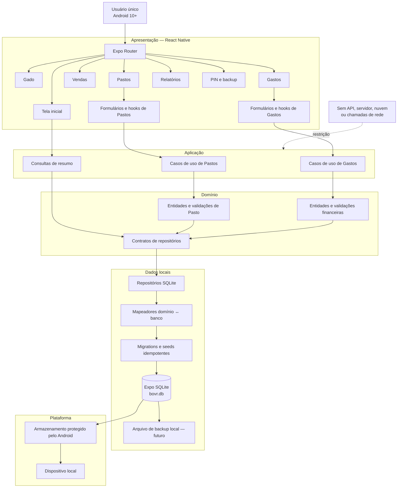

# Arquitetura do BOVR

O BOVR é um aplicativo Android de usuário único, totalmente offline. A interface
não acessa SQL diretamente: cada tela chama casos de uso, que dependem de
contratos de repositório implementados pela camada SQLite.

## Decisões

- Expo SDK 57, React Native, TypeScript e Expo Router formam a plataforma.
- Expo SQLite é a única fonte persistente de dados; chaves estrangeiras ficam
  habilitadas e o banco opera em modo WAL.
- Dinheiro é armazenado como centavos inteiros e datas como `YYYY-MM-DD`.
- As categorias Água, Ração, Mão de obra e Infraestrutura são seeds protegidos.
- Registros auxiliares em uso não são excluídos em cascata.
- Não há backend, sincronização, telemetria, notificações ou chamadas de rede.
