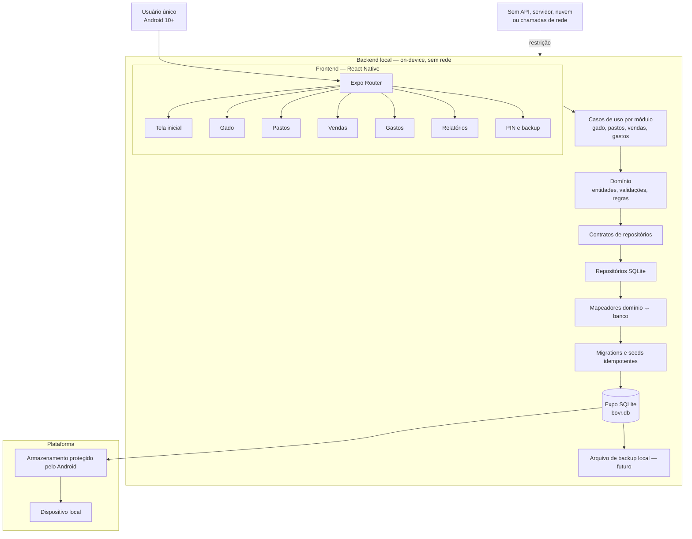

# Arquitetura do BOVR — V1.1

O BOVR é um aplicativo Android de usuário único, totalmente offline. O sistema é
dividido em duas camadas no próprio aparelho: o **frontend** (telas e navegação
em React Native) e o **backend local** (domínio, casos de uso e acesso a dados
via SQLite). Nenhuma camada faz chamadas de rede.

> ⚠️ **Decisão de escopo (gerente do projeto):** somente vendas realizadas.
> **RF-21 / B-18 (vendas planejadas) estão desconsiderados por enquanto**, até a
> próxima reunião definir (conflito RF-21 × P-07). Nenhuma tabela de vendas
> planejadas nesta versão.

## Decisões

- Expo SDK 57, React Native, TypeScript e Expo Router formam a plataforma.
- O backend é **local e on-device**: domínio, casos de uso e repositórios
  executam no próprio aparelho, sem servidor, sincronização, telemetria,
  notificações ou chamadas de rede.
- O frontend (telas) nunca acessa SQL diretamente — só consome casos de uso e
  contratos de repositório do backend local (baixo acoplamento, RNF-14).
- Expo SQLite é a única fonte persistente de dados; chaves estrangeiras ficam
  habilitadas e o banco opera em modo WAL.
- Dinheiro é armazenado como centavos inteiros e datas como `YYYY-MM-DD`.
- As categorias Água, Ração, Mão de obra e Infraestrutura são seeds protegidos.
- Registros auxiliares em uso não são excluídos em cascata.

## Convenções de nomenclatura (V1.1)

- **Banco 100% em inglês**, `snake_case`. A RNF-17 exige pt-BR só na
  **interface** — identificadores do schema nunca misturam idiomas.
- Nomes revelam intenção sem precisar da documentação (Clean Code, Cap. 1):
  `pasture_inspections` (vistoria de qualidade datada),
  `herd_memberships` (histórico de pertencimento a lotes),
  `sale_items` (bovino + peso individual da venda).
- `lots` foi rejeitado por ambiguidade; lote de manejo = `herds`.
- Bovino = `cattle` (aplicativo focado em bovinos).
- Timestamps em `TEXT ISO8601` (SQLite não tem `TIMESTAMPTZ`); dinheiro em
  centavos (`INTEGER`); datas de negócio em `YYYY-MM-DD`.
- PKs surrogate `INTEGER AUTOINCREMENT`; brinco (`tag_number`) é identificador
  de negócio com `UNIQUE` parcial entre ativos, nunca PK.

## DER — modelo de dados (V1.1)

```mermaid
erDiagram
    HERDS ||--o{ CATTLE : "current herd"
    HERDS ||--o{ HERD_MEMBERSHIPS : "membership history"
    CATTLE ||--o{ HERD_MEMBERSHIPS : "belonged to"
    CATTLE }o--o| CATTLE : "mother of calf"
    GRASS_TYPES ||--o{ PASTURES : "planted with"
    PASTURES ||--o{ CATTLE : "currently grazing"
    PASTURES ||--o{ PASTURE_INSPECTIONS : "quality inspections"
    PASTURES ||--o{ PASTURE_MOVEMENTS : "as origin"
    PASTURES ||--o{ PASTURE_MOVEMENTS : "as destination"
    CATTLE |o--o{ PASTURE_MOVEMENTS : "moved animal"
    HERDS |o--o{ PASTURE_MOVEMENTS : "moved herd"
    CATTLE ||--o{ REPRODUCTIVE_EVENTS : "reproductive history"
    CATTLE ||--o{ VACCINATIONS : "doses received"
    CATTLE ||--o{ HEALTH_EVENTS : "health log"
    SALES ||--o{ SALE_ITEMS : "items sold"
    CATTLE ||--o{ SALE_ITEMS : "sold as"
    EXPENSE_CATEGORIES ||--o{ EXPENSES : "categorized as"
    EXPENSE_CATEGORIES ||--o{ EXPENSE_SUBCATEGORIES : "has"
    EXPENSE_SUBCATEGORIES }o--o| EXPENSES : "detailed as"

    HERDS {
        INTEGER id PK
        TEXT name "management group (Lote)"
        TEXT description "nullable"
        TEXT created_at
        TEXT updated_at
    }
    CATTLE {
        INTEGER id PK
        TEXT tag_number "ear tag, unique while active"
        TEXT sex "male|female"
        TEXT birth_date "nullable YYYY-MM-DD"
        INTEGER estimated_age_months "nullable, when birth unknown"
        TEXT breed
        TEXT notes "nullable"
        INTEGER herd_id FK "nullable, one herd at a time"
        INTEGER pasture_id FK "nullable, one pasture at a time"
        TEXT status "active|sold|dead|transferred"
        INTEGER mother_id "self FK nullable, calf link"
        TEXT created_at
        TEXT updated_at
    }
    HERD_MEMBERSHIPS {
        INTEGER id PK
        INTEGER cattle_id FK "RESTRICT, history survives"
        INTEGER herd_id FK "RESTRICT"
        TEXT entered_on "YYYY-MM-DD"
        TEXT exited_on "nullable YYYY-MM-DD"
    }
    GRASS_TYPES {
        INTEGER id PK
        TEXT name "UNIQUE NOCASE"
        REAL min_height_cm "ideal minimum"
        REAL max_height_cm "ideal maximum"
    }
    PASTURES {
        INTEGER id PK
        TEXT name
        REAL area_hectares
        INTEGER grass_type_id FK "RESTRICT"
        TEXT created_at
        TEXT updated_at
    }
    PASTURE_INSPECTIONS {
        INTEGER id PK
        INTEGER pasture_id FK "RESTRICT"
        TEXT inspected_on "field visit date"
        REAL grass_height_cm "measured height"
        TEXT grass_condition "green|partly_dry|dry"
        INTEGER coverage_percent "0 to 100"
        TEXT quality "good|fair|poor, computed at save"
    }
    PASTURE_MOVEMENTS {
        INTEGER id PK
        INTEGER cattle_id FK "nullable, one of cattle/herd"
        INTEGER herd_id FK "nullable, one of cattle/herd"
        INTEGER origin_pasture_id FK
        INTEGER destination_pasture_id FK "different from origin"
        TEXT moved_on "YYYY-MM-DD"
    }
    REPRODUCTIVE_EVENTS {
        INTEGER id PK
        INTEGER cattle_id FK "RESTRICT, females"
        TEXT status "unevaluated|open|pregnant|calved"
        TEXT check_date "nullable, pregnancy diagnosis date"
        TEXT breeding_date "nullable"
        TEXT expected_calving_date "nullable, auto from breeding"
    }
    VACCINATIONS {
        INTEGER id PK
        INTEGER cattle_id FK "RESTRICT"
        TEXT vaccine_name
        TEXT given_on "YYYY-MM-DD"
        TEXT dose
        TEXT notes "nullable"
    }
    HEALTH_EVENTS {
        INTEGER id PK
        INTEGER cattle_id FK "RESTRICT"
        TEXT happened_on "YYYY-MM-DD"
        TEXT description
        TEXT treatment "nullable"
        TEXT status "under_treatment|recovered|closed"
        TEXT origin "case|injury_note"
    }
    SALES {
        INTEGER id PK
        TEXT sold_on "YYYY-MM-DD"
        TEXT buyer "free text"
        INTEGER gross_amount_cents "all mandatory"
        TEXT notes
        TEXT created_at
        TEXT updated_at
    }
    SALE_ITEMS {
        INTEGER id PK
        INTEGER sale_id FK "CASCADE, meaningless alone"
        INTEGER cattle_id FK "RESTRICT, keeps history"
        REAL weight_kg "individual weight"
    }
    EXPENSE_CATEGORIES {
        INTEGER id PK
        TEXT name "UNIQUE NOCASE"
        INTEGER is_system "1 for Water Feed Labor Infrastructure seeds"
    }
    EXPENSE_SUBCATEGORIES {
        INTEGER id PK
        INTEGER category_id FK "RESTRICT"
        TEXT name "UNIQUE per category"
    }
    EXPENSES {
        INTEGER id PK
        TEXT description
        INTEGER category_id FK "RESTRICT"
        INTEGER subcategory_id FK "nullable RESTRICT"
        INTEGER amount_cents
        TEXT expense_date "YYYY-MM-DD"
    }
```

**Legenda do DER (pé-de-galinha):** `||` = exatamente um · `o{` = zero ou
mais · `o|` = zero ou um · `}o` = zero ou mais (lado esquerdo). As
cardinalidades do diagrama espelham a tabela em
`### Cardinalidades (V1.1)` — qualquer divergência entre os dois é erro.

### Regras de integridade do DER

- `tag_number` tem `UNIQUE` **parcial** só entre `status = 'active'`
  (RF-01.1/RF-01.2 × RF-06.1: vendidos/mortos/transferidos permanecem no
  histórico com o mesmo brinco).
- Sem `DELETE` físico em `cattle` e `sales` — só troca de `status`. Histórico
  de lotes, vacinas, saúde e itens de venda usa `ON DELETE RESTRICT`.
- Única exceção: `sale_items.sale_id → ON DELETE CASCADE` (item sem venda não
  tem sentido sozinho).
- `pasture_movements` exige exatamente um dos dois (`cattle_id` ou `herd_id`)
  e `destination_pasture_id ≠ origin_pasture_id` (via `CHECK`).
- `pasture_inspections.quality` é gravada a cada vistoria (histórico RF-15.3),
  calculada de altura × condição × cobertura (RF-15.2).

### Cardinalidades (V1.1)

Regra aplicada: 1:N = FK no lado N, sem tabela extra · N:N = tabela associativa.

| # | Relacionamento | Cardinalidade | Implementação | Base |
|---|---|---|---|---|
| 1 | `herds` ↔ `cattle` (lote atual) | 1:N | FK `cattle.herd_id` → `herds(id)`, anulável | RF-02.1, RD-03 |
| 2 | `cattle` ↔ `herds` (histórico) | N:N no tempo | Associativa `herd_memberships` (`cattle_id`, `herd_id`, `entered_on`, `exited_on`) | RF-02.3 |
| 3 | `cattle` ↔ `cattle` (mãe–bezerro) | 1:N | Auto-FK `cattle.mother_id` → `cattle(id)`, anulável | RF-10 |
| 4 | `grass_types` ↔ `pastures` | 1:N | FK `pastures.grass_type_id` NOT NULL, `RESTRICT` | RF-16.3 |
| 5 | `pastures` ↔ `cattle` (pasto atual) | 1:N | FK `cattle.pasture_id` → `pastures(id)`, anulável | RD-03, RF-18.1 |
| 6 | `pastures` ↔ `pasture_inspections` | 1:N | FK `pasture_inspections.pasture_id` NOT NULL, `RESTRICT` | RF-15.3 |
| 7 | `pastures` ↔ `pasture_movements` (origem) | 1:N | FK `origin_pasture_id` NOT NULL | RF-17.1 |
| 8 | `pastures` ↔ `pasture_movements` (destino) | 1:N | FK `destination_pasture_id` NOT NULL, `≠ origem` | RF-17.1 |
| 9 | `cattle` ↔ `pasture_movements` | 1:N condicional | FK `cattle_id` anulável; XOR com `herd_id` via `CHECK` | RF-17 |
| 10 | `herds` ↔ `pasture_movements` | 1:N condicional | FK `herd_id` anulável; XOR com `cattle_id` via `CHECK` | RF-17 |
| 11 | `cattle` ↔ `reproductive_events` | 1:N | FK `cattle_id` NOT NULL, `RESTRICT` | RF-08 |
| 12 | `cattle` ↔ `vaccinations` | 1:N | FK `cattle_id` NOT NULL, `RESTRICT` | RF-11.3 |
| 13 | `cattle` ↔ `health_events` | 1:N | FK `cattle_id` NOT NULL, `RESTRICT` | RF-12 |
| 14 | `sales` ↔ `cattle` | N:N | Associativa `sale_items` (`sale_id`, `cattle_id`, `weight_kg`) | RF-19.1/19.2 |
| 15 | `expense_categories` ↔ `expenses` | 1:N | FK `expenses.category_id` NOT NULL, `RESTRICT` | RF-22.1 |
| 16 | `expense_categories` ↔ `expense_subcategories` | 1:N | FK `subcategories.category_id` NOT NULL, `RESTRICT` | RF-22.4 |
| 17 | `expense_subcategories` ↔ `expenses` | 1:N opcional | FK `expenses.subcategory_id` anulável, `RESTRICT` | RF-22.4 |

Nenhum relacionamento 1:1 no modelo — nenhuma entidade é mera extensão de
outra. O item 9/10 é o único não-canônico (FK condicional com XOR em uma tabela
única, preservando o histórico de rotação do pasto — RF-17.2 — numa consulta só).

## Rastreabilidade RF → tabela (V1.1)

| Requisito | Tabelas |
|---|---|
| RF-01–RF-07 (gado, lotes) | `cattle`, `herds`, `herd_memberships` |
| RF-08–RF-10 (reprodução) | `reproductive_events`, `cattle.mother_id` |
| RF-11 (vacinação) | `vaccinations` |
| RF-12–RF-13 (saúde) | `health_events` |
| RF-15–RF-16 (pastos, capim) | `pastures`, `grass_types`, `pasture_inspections` |
| RF-17 (movimentação) | `pasture_movements` |
| RF-18 (lotação, permanência, descanso) | `cattle`, `pasture_movements`, `pasture_inspections` (consultas) |
| RF-19–RF-20 (vendas) | `sales`, `sale_items` |
| RF-21 (planejadas) | **fora de escopo nesta versão** (decisão do gerente) |
| RF-22–RF-24 (gastos) | `expense_categories`, `expense_subcategories`, `expenses` |
| RF-25 (resultado financeiro) | `sales` + `expenses` (consulta) |
| RF-26–RF-30 (relatórios) | consultas sobre as tabelas acima |
| RF-31–RF-36 (offline, backup) | `bovr.db` local; backup/restauração fora do DER |
| RNF-12/RNF-13 (PIN, proteção) | fora do DER — pendentes P-12/P-18 |

## Índices previstos (V1.1)

- `UNIQUE` parcial: `cattle(tag_number) WHERE status = 'active'`.
- `UNIQUE`: `grass_types(name)`, `herds(name)`, `expense_categories(name)`,
  `(expense_subcategories.category_id, name)`.
- FKs e filtros: `cattle(herd_id)`, `cattle(pasture_id)`, `cattle(status)`,
  `herd_memberships(cattle_id)`, `vaccinations(cattle_id, given_on)`,
  `health_events(cattle_id, status)`, `pasture_inspections(pasture_id, inspected_on)`,
  `pasture_movements(destination_pasture_id, moved_on)`,
  `sale_items(sale_id)`, `sale_items(cattle_id)`,
  `expenses(expense_date DESC)`, `expenses(category_id)`.
- Composto leitura financeira: `expenses(category_id, expense_date)`.
